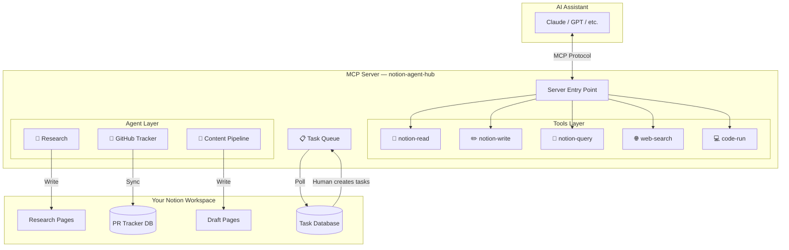

# 🤖 Notion Agent Hub

> **AI Agent Hub for Notion** — orchestrate AI agents through Notion databases with human-in-the-loop approval. Built with MCP.

<!-- Hero Banner -->
<div align="center">


**Turn your Notion workspace into an AI command center.**

[Quick Start](#-quick-start) · [Architecture](#-architecture) · [Tools](#-tools) · [Agents](#-agent-workflows) · [Setup Guide](docs/setup.md)

</div>

---

## ✨ What It Does

Notion Agent Hub is an **MCP server** that connects AI assistants (Claude, GPT, etc.) to your Notion workspace. It provides:

1. **🔍 Research Agent** — Search the web, compile findings, and write structured research pages to Notion
2. **🔄 GitHub Tracker** — Monitor GitHub PRs and sync their status to a Notion database
3. **📝 Content Pipeline** — Read outlines from Notion, generate drafts, and submit for human review

All tasks flow through a **Notion-native task queue** with human-in-the-loop approval — you stay in control.

## 🏗 Architecture



## 🚀 Quick Start

### 1. Clone & Install

```bash
git clone https://github.com/tysoncung/notion-agent-hub.git
cd notion-agent-hub
npm install
```

### 2. Configure

```bash
cp .env.example .env
```

Edit `.env` with your keys:

```env
NOTION_API_KEY=ntn_your_integration_secret
NOTION_DATABASE_ID=your_task_database_id
OPENAI_API_KEY=sk-your_openai_key  # Optional
```

> 📖 See the [Setup Guide](docs/setup.md) for detailed instructions on creating a Notion integration and task database.

### 3. Build & Run

```bash
npm run build
npm start
```

### 4. Connect to Claude Desktop

Add to your Claude Desktop config:

```json
{
  "mcpServers": {
    "notion-agent-hub": {
      "command": "node",
      "args": ["/path/to/notion-agent-hub/dist/index.js"],
      "env": {
        "NOTION_API_KEY": "ntn_your_key",
        "NOTION_DATABASE_ID": "your_db_id"
      }
    }
  }
}
```

## 🛠 Tools

### `notion-read`

Read pages, databases, and blocks from Notion.

```
Input:  { page_id?: string, database_id?: string, block_id?: string }
Output: Page content with properties and child blocks
```

### `notion-write`

Create or update Notion pages with rich content.

```
Input:  { action: "create" | "update" | "append", parent_id?, page_id?, title?, blocks? }
Output: { id, url, created/updated/appended: true }
```

Supported block types: `paragraph`, `heading_1/2/3`, `bulleted_list_item`, `numbered_list_item`, `toggle`, `quote`, `callout`, `divider`, `code`

### `notion-query`

Query databases with filters and sorting.

```
Input:  { database_id, filter?, sorts?, page_size? }
Output: { results: [...pages], has_more, next_cursor }
```

### `web-search`

Search the web using Brave Search (or DuckDuckGo fallback).

```
Input:  { query: string, count?: number }
Output: { results: [{ title, url, snippet }], source }
```

### `code-run`

Execute JavaScript in a sandboxed environment (Node.js vm module).

```
Input:  { code: string, timeout_ms?: number }
Output: { success, result?, stdout, stderr }
```

## 🤖 Agent Workflows

### 🔬 Research Agent

**Input:** Topic + parent page ID  
**Process:** Web search → compile sources → create structured Notion page  
**Output:** Research page with sources, findings, and review checklist

### 🔄 GitHub Tracker

**Input:** GitHub repo + Notion database ID  
**Process:** Fetch PRs → compare with existing entries → create/update pages  
**Output:** Synced PR database in Notion

### 📝 Content Pipeline

**Input:** Outline page ID + parent page ID  
**Process:** Read outline → (optional research) → generate draft → create page  
**Output:** Draft page with review checklist, ready for human editing

## 🔄 Human-in-the-Loop

The task queue uses your Notion database as the control plane:

```
You create a task          →  Status: Pending
Agent picks it up          →  Status: Running
Agent writes results       →  Status: Done ✅
Something went wrong?      →  Status: Failed ❌ (with error details)
```

**You're always in control.** Tasks only run when you create them. Results are always written back to Notion for your review.

### Task Database Schema

| Property | Type   | Description                     |
|----------|--------|---------------------------------|
| Name     | Title  | Task description                |
| Status   | Status | Pending → Running → Done/Failed |
| Type     | Select | research / github-tracker / content-pipeline |
| Input    | Text   | JSON input parameters           |
| Output   | Text   | JSON results                    |
| Error    | Text   | Error message (if failed)       |

## 📸 Demo

<!-- TODO: Add demo GIF showing the workflow -->


## 🧪 Development

```bash
# Run tests
npm test

# Watch mode
npm run test:watch

# Type checking
npm run lint

# Build
npm run build

# Dev mode (watch + rebuild)
npm run dev
```

## 📜 License

MIT — see [LICENSE](LICENSE).

---

<div align="center">

**Built for the [Notion MCP Challenge](https://notion.so)** 🏆

Powered by [Model Context Protocol](https://modelcontextprotocol.io)

</div>
