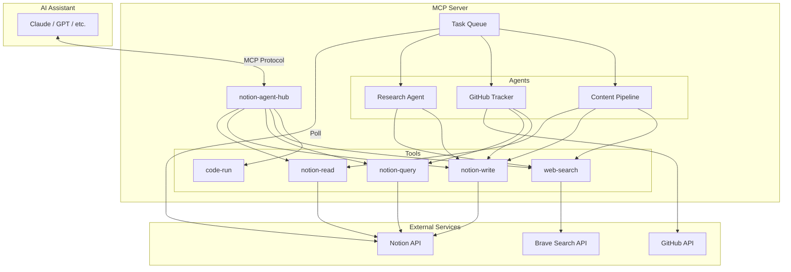
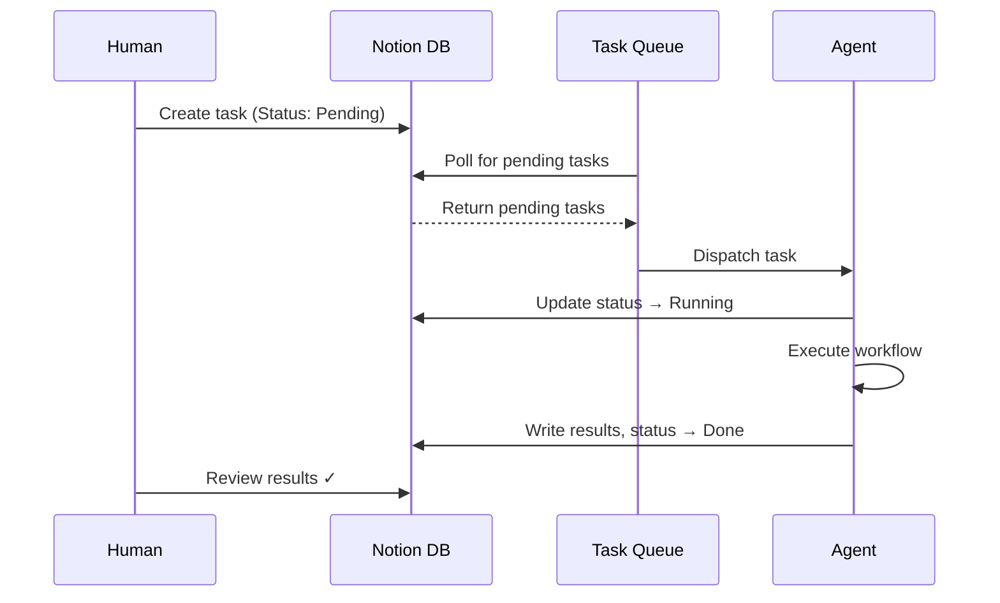

# Architecture

## Overview

Notion Agent Hub is an MCP server that bridges AI assistants with Notion workspaces. It provides tools for reading, writing, and querying Notion, plus higher-level agent workflows that combine these tools.

## System Architecture

## Data Flow

### MCP Tool Calls

1. AI assistant sends a tool call via MCP protocol
2. Server validates input with Zod schemas
3. Tool executes against external APIs
4. Results returned as structured JSON

### Task Queue (Human-in-the-Loop)

1. Human creates a task in the Notion database
2. Sets status to **Pending** and fills in Input
3. Queue polls the database for pending tasks
4. Agent picks up task, sets status to **Running**
5. Agent executes the workflow
6. Results written back, status set to **Done**
7. Human reviews the output

## Components

### Tools

| Tool | Description | API |
|------|-------------|-----|
| `notion-read` | Read pages, databases, blocks | Notion |
| `notion-write` | Create/update pages with rich blocks | Notion |
| `notion-query` | Query databases with filters/sorts | Notion |
| `web-search` | Search the web | Brave / DDG |
| `code-run` | Execute JavaScript in sandbox | Node vm |

### Agents

| Agent | Inputs | Outputs |
|-------|--------|---------|
| Research | topic, parent_id | Notion page with sources & findings |
| GitHub Tracker | repo, database_id | Synced PR statuses in Notion |
| Content Pipeline | outline_page_id, parent_id | Draft page for review |

### Queue

The task queue bridges human intent with agent execution:

- **Polling interval:** 10 seconds (configurable)
- **Concurrency:** Sequential (one task at a time)
- **Error handling:** Failed tasks marked with error message
- **Idempotency:** Tasks claimed atomically via status update
